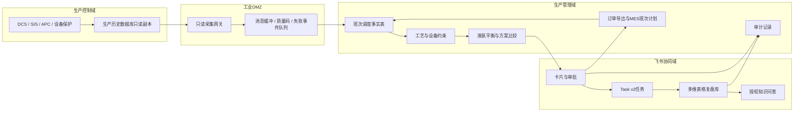

# 平台架构设计

## 平台位置

氨智领航调控师部署在生产运行管理层，服务调度员、班长、调度主管、设备、安环和经营人员。参照ISA-95的层级边界，企业计划与经营数据、制造运营数据和控制系统数据通过明确接口交换；DCS、SIS、APC和设备保护系统继续承担控制、报警和保护。

## 交付状态

- 已验证：本地交互工作台、飞书在线方案稿、多维表格样例库、Task v2任务清单和验收任务`t136777`。
- 原型：互动卡片、负荷调整审批状态机、跨装置动作单门禁、事件回传字段契约和班后案例审核流程。
- 待授权：ERP/MES、生产历史数据库、APC、设备软件和公用工程接口，真实点位、阈值、财务口径、目标群机器人、审批定义与Aily知识源。

## 部署与数据流

生产控制域向生产管理域只读出数。审批通过后仅允许写入MES计划摘要、交接说明和复盘记录，不提供DCS/SIS写入路径。

## 数据与建议记录

每条事实至少记录来源系统、源时间、接收时间、单位、质量状态、责任专业和值。每条建议记录建议编号、输入快照、规则或模型版本、有效期、审批路径、撤销条件和防重复处理键。市场价格未经经营人员确认时只作提示，不进入可执行方案。

## 证据包与交接

当班工作区可以导出 `data/evidence_package_schema.json` 约束的 JSON 证据包。它把输入快照、执行价版本、物料平衡、门禁结论、跨装置动作单、飞书流转状态和最近审计事件放在同一份交接物中，便于班长复核、企业专家抽查和后续映射到飞书多维表格。导出动作本身不代表审批或执行成功；没有 Historian 或企业认可的事实源时，实际负荷、库存、能耗和收益字段保持为空。

## 状态与异常处理

`草稿 -> 待班长确认 -> 已批准 -> 四岗位接令 -> 执行跟踪 -> 班末复盘 -> 归档`

审批通过后，合成主操、硝酸主操、罐区/调度和公辅调度分别接收同一方案版本的动作单。四岗位全部接令后才开放执行跟踪；接令只表示收到方案并确认责任，实际负荷、库存和能耗仍以Historian或企业认可的只读事实源为准，无回传时保持为空。驳回、超时或数据失效进入重新计算分支。任何状态变化记录操作人、时间、原因和前后状态；重复事件由防重复处理键拦截，处理失败的事件进入待处理队列，由指定人员补录或重试。

## 条件驱动处置

审批不由任何汇总分数驱动。每条输入先匹配可追溯的字段条件、持续时间和数据质量规则，再进入以下三类处置：

1. 一般提示：数据有效，未命中专业会签条件或演练停算线时，显示趋势、偏差和核对事项；是否提交方案仍由调度员判断。
2. 相关专业会签：设备趋势达到样例中的`specialist_review`条件，公辅约束余量异常或失效，液氨库存接近企业确认边界，或其他已登记条件成立时，明确通知设备、公辅、罐区或工艺专业。会签依据是具体字段、时间窗和规则版本，不是汇总分数。
3. 演练停算线：命中`stop_new_recommendation_demo`或接口矩阵中登记的停算条件时，停止生成新目标、经济排序、动作单和审批，维持最近批准方案，并转入企业现场规程。演练阈值不直接作为生产阈值，须在30天校核后由企业冻结。

## 核心模块

| 模块 | 首批作用 | 验收证据 |
| --- | --- | --- |
| 班次调度事实表 | 统一订单、库存、班次计划和协同记录，后续扩展工况与设备数据 | 来源、时间戳、单位、质量状态和责任专业 |
| 24小时液氨平衡 | 期初可用量+预计产量+外采-各去向分配=期末可用量 | 吨数守恒、安全库存和可支撑小时数 |
| 相对外售分配贡献账本 | 比较下游分配与液氨外售基准的24小时测算值 | 财务可逐项复算，不表述为已实现收益 |
| 设备趋势异常提示 | 展示振动、轴位移、防喘振裕度、轴承温度等趋势 | 与DCS报警分开、数据来源、检查项和责任专业 |
| 协同执行 | 卡片、审批、任务和班后记录 | 状态、负责人、执行偏差和未采纳原因 |
| 案例审核 | 班后记录进入待审核案例库 | 审核人、适用条件、规则版本和撤销版本 |

## 运行治理

- 调度员查看并提交建议；命中设备、公辅、库存等明确条件时，由调度主管和对应专业会签；命中演练停算线时不得新建审批。
- 应用密钥只保存在服务端密钥库；飞书事件回传需要验签、防重放和来源限制。
- 数据过期、质量状态无效、关键字段缺失、输入超出适用工况范围或安全与设备限值接近时，停止给出可执行建议并转人工处理。
- 班后记录未经审核不能直接成为生产规则；规则和模型均保留版本与撤销路径。

## 架构依据

- ISA-95：`https://www.isa.org/standards-and-publications/isa-standards/isa-95-standard`
- ISA-18：`https://www.isa.org/standards-and-publications/isa-standards/isa-18-series-of-standards`
## Pricing and execution-price boundary

Price is not a single real-time field. Public sources provide benchmarks and trend cross-checks; enterprise ERP, sales quotations, and procurement settlement provide execution prices. Every price record keeps source URL, publication time, fetch time, business effective time, unit, tax/freight basis, confirmer, and version.

`scripts/market_gateway_server.mjs` is an adapter prototype for the registered public sources. If the gateway is unavailable, the UI shows a degraded state. If a public reference is not confirmed by the business owner, the platform freezes the execution price and economic ranking and does not create a new executable plan. Enterprise deployment should replace the ERP connector on the server side; no credential belongs in the browser.
