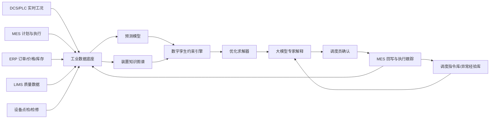

# 平台架构设计

## 目标

打造一个面向合成氨装置现场的 AI 生产调度专家，让调度员在安全边界内快速回答四个问题：

1. 今天装置应该跑多少负荷？
2. 产出的氨优先给下游、库存还是外售？
3. 当前方案触发了哪些安全、设备、能耗或订单约束？
4. 这个排产方案相比经验调度能带来多少经营价值？

补充试题进一步强调：硬件层面的单位生产成本已接近理论最优，真正空间在运行管理的软件层。因此方案必须直面三类企业痛点：多因素联合优化导致的调度寻优难、人工链条长导致的指挥效率低、专家经验不能沉淀导致的知识传承难。平台不应只是看板，而应具备“实时感知、成本寻优、方案生成、指挥协同、执行监督、知识沉淀、自我迭代”的超级数字员工闭环能力。

## 超级数字员工能力矩阵

| 企业挑战 | 数字员工能力 | 可操作设计 |
| --- | --- | --- |
| 调度寻优难 | 成本寻优雷达、三案比选、约束孪生 | 实时拆解能源、库存、设备、订单切换、操作偏差的成本挖潜来源 |
| 指挥效率低 | 调控师指令窗口、审批链、执行监督 | 一键重算、生成交接摘要、标记采纳，自动跟踪负荷偏差和库存变化 |
| 知识传承难 | 指令库、异常库、未采纳原因标签 | 每次方案、采纳/未采纳原因、执行结果进入知识库，用于周度迭代 |

## 总体架构

## 核心模块

### 1. 数据底座

- 实时工况：温度、压力、流量、氢氮比、循环压缩机负荷、合成塔床层温升。
- 经营数据：尿浆、复合肥、液氨外售、氯化铵配套订单和交期。
- 资源数据：天然气/煤/电/蒸汽价格，绿电或绿氢可用性。
- 库存物流：液氨罐区、包装线、装车窗口、下游产线缓冲能力。
- 设备状态：压缩机振动、换热器效率、催化剂活性、计划检修。

### 2. 预测层

- 订单需求预测：按产品、区域、交期、利润贡献预测下游需求。
- 能源价格预测：识别高价能源窗口和可错峰时段。
- 设备健康预测：估算压缩机、换热器、合成塔和罐区风险。
- 库存演化预测：模拟液氨库存和下游消耗曲线。

### 3. 数字孪生约束层

- 硬约束：安全库存、罐区压力、合成塔温升、压缩机上限、最低稳定负荷。
- 软约束：订单延期成本、能耗成本、切换成本、班组操作复杂度。
- 校验方式：机理模型给边界，历史数据校正偏差，专家规则处理异常场景。

### 4. 优化调度层

- 班次级调度：输出 8-24 小时生产负荷、下游分配、库存策略和点检窗口。
- 日级计划：平衡多产品订单、能价、库存和检修。
- 周级协同：联动复合肥、联碱、尿浆、物流和原料采购。
- 方法组合：混合整数规划处理订单与切换，MPC 处理连续负荷，启发式搜索处理现场规则。

### 5. 大模型专家层

- 将优化结果翻译成调度语言。
- 对每个建议给出原因、约束、收益和风险。
- 支持追问：“如果压缩机状态下降 10%，怎么排？”“如果复合肥订单提前一天呢？”
- 生成班前会摘要、交接班说明和异常复盘。

### 6. 数据治理层

- 主数据统一：产品、装置、罐区、订单、班次、设备位号、能源计量点统一编码。
- 质量规则：记录缺失率、异常值、采样间隔、手工录入比例、口径变更时间。
- 数据血缘：每条推荐方案都能追溯到输入数据版本、模型版本和约束规则版本。
- 口径对齐：生产口径、财务口径、库存口径和调度口径需要在平台中明确转换关系。

### 7. 模型治理层

- 灰度上线：先离线回放，再影子模式，再人机确认，最后局部闭环。
- 置信阈值：低置信方案只作为备选建议，高风险方案必须双人确认。
- 漂移监控：监控订单预测、设备健康预测、能耗模型和库存模型的偏差。
- 回滚机制：当模型偏差连续超阈值，自动降级到专家规则和人工调度。

### 8. 安全与权限层

- AI 不直接绕过 DCS/SIS/MES 安全边界，只输出建议和经审批的计划。
- 分角色权限：班长看操作建议，调度看排产全局，设备看健康风险，经营看订单收益，安环看红线约束。
- 留痕审计：记录谁采纳、何时采纳、采纳前后关键 KPI、执行偏差和复盘结论。
- 应急降级：网络中断、数据延迟、模型低置信时，平台降级为规则库和人工流程。

### 9. 知识库与自学习层

- 调度指令库：记录“输入状态-推荐方案-审批人-执行动作-偏差结果”。
- 异常处置经验库：沉淀库存偏低、设备健康下降、能源价格冲高、订单插单等场景。
- 未采纳原因库：把安全边界、设备风险、订单变化、数据不可信、经验判断等原因结构化。
- 周度迭代：将高风险、高偏差、高价值样本进入模型校准和规则修订队列。

## 最小可行版本

1. 接入历史 CSV 或接口样例，先做离线仿真。
2. 覆盖合成氨、液氨库存、尿浆和复合肥四个关键节点。
3. 输出 24 小时排产建议、风险解释和价值测算。
4. 由调度员人工确认，不自动控制装置。
5. 每天复盘预测偏差和调度收益。

## 企业试点务实边界

企业真正关心的不是“AI 能不能算”，而是“能不能低风险嵌入现有生产组织”。因此 MVP 要把范围压小：

- **先不碰控制层**：不改 DCS/SIS 控制逻辑，不自动开停车，不越过现有审批链。
- **先做薄应用**：复用现有 MES、ERP、DCS historian、罐区和设备点检系统，不重做 MES/ERP。
- **先影子运行**：连续 4-6 周输出建议但不回写，记录调度员是否采纳和原因。
- **先算真实收益**：只统计采纳方案带来的能耗、库存、订单、停车风险改善，不把行情上涨算成 AI 收益。
- **先守住降级**：数据延迟、模型低置信、安环红线接近时，自动退回人工调度和专家规则。

## 首批接口清单

| 系统 | 首批字段 | 频率 | 用途 |
| --- | --- | --- | --- |
| MES | 日计划、班次产量、执行偏差、偏差原因 | 班次/小时 | 对比计划与实际，生成班后复盘 |
| ERP | 订单、交期、客户优先级、价格口径 | 日/订单变更 | 判断订单优先级和延期成本 |
| DCS historian | 负荷、温度、压力、流量、电耗、蒸汽摘要点 | 5-15 分钟聚合 | 判断装置边界，不直接控制 |
| 罐区系统 | 液氨库存、罐区压力、装车窗口 | 分钟/小时 | 约束库存和外售节奏 |
| EAM/点检 | 设备健康评分、检修计划、异常工单 | 日/事件 | 约束压缩机、合成塔和换热器风险 |

## 班组日常流程

1. **班前 30 分钟**：平台刷新订单、库存、设备健康和能源窗口，生成稳态、冲刺、保守三套方案。
2. **班前会 10 分钟**：班长只看与原计划的差异、风险红线、需要确认的动作。
3. **班中偏差**：库存、设备或订单超阈值时触发重算；未确认前仍按原计划执行。
4. **班后 5 分钟**：记录采纳与否、实际负荷、能耗、订单完成和异常原因。
5. **周度复盘**：调度、设备、经营、安环共同确认收益归因和规则修订。

## 验收与停用条件

- **通过条件**：高优订单满足率不低于人工排产，且单位氨能耗、库存占用、调度耗时或异常预警至少一项稳定改善。
- **停用条件**：关键数据延迟超过 15 分钟、核心点位缺失、模型连续两天偏差超阈值、安环红线接近且无法解释。
- **推广条件**：至少完成一个月影子运行、三次异常场景复盘、一份调度员采纳/不采纳原因清单。

## 大框架查漏补缺

当前方案最需要补齐的不是再加一个算法，而是让平台具备工业现场可信度：

- **数据可信**：没有统一位号、订单和库存口径，优化器输出再漂亮也难进入班组执行。
- **模型可信**：需要置信度、漂移、回放验证和回滚机制，否则 AI 推荐很难被调度员长期采纳。
- **安全可信**：合成氨是高压、高温、高风险连续流程，AI 必须服从安全硬约束和人工确认。
- **组织可信**：调度、设备、安环、经营的目标不同，平台要把冲突转化为同一张收益-风险解释表。
- **价值可信**：收益不能只写“降本增效”，要绑定订单满足率、单位能耗、库存占用、停车风险和决策时长。

## 推广路线

- **第 1 阶段：可视化驾驶舱**  
  统一订单、库存、能耗、设备状态，解决信息分散。

- **第 2 阶段：离线推荐**  
  基于历史数据回放，验证 AI 推荐是否优于经验调度。

- **第 3 阶段：人机协同执行**  
  由 AI 推荐、调度员确认、MES 回写，形成闭环。

- **第 4 阶段：多基地推广**  
  将约束模板迁移到复合肥、联碱、黄磷、磷酸铁等协同场景。

## 量化价值指标

- 高优订单满足率提升 3%-8%。
- 单位氨能耗下降 2%-6%。
- 液氨安全库存占用下降 5%-12%。
- 非计划停车风险提前预警 4-12 小时。
- 班前会排产决策时间从小时级缩短到分钟级。

上述指标在正式立项时建议采用保守口径：先以历史回放验证方向，再以影子运行验证采纳率，最后只对“被采纳且实际执行”的方案核算收益。

## 当前原型说明

本仓库提供一个静态前端原型，使用滑块模拟订单、能价、设备健康、库存和市场波动。页面会实时计算推荐负荷、日产氨、风险指数、价值测算和班次 Gantt 图。它不是控制系统，而是用于表达产品思路和评审演示的交互样机。
