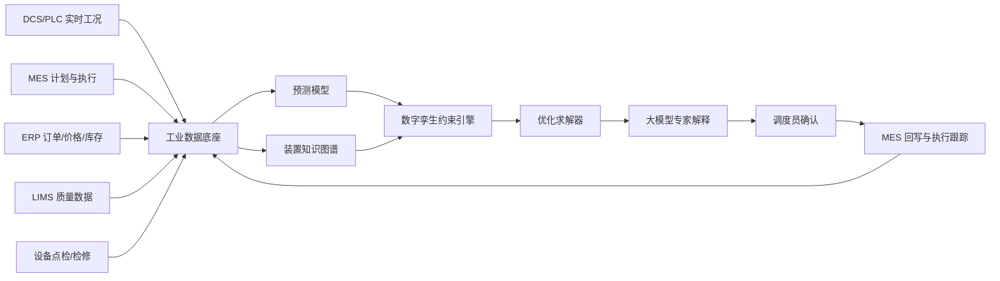

# 平台架构设计

## 目标

打造一个面向合成氨装置现场的 AI 生产调度专家，让调度员在安全边界内快速回答四个问题：

1. 今天装置应该跑多少负荷？
2. 产出的氨优先给下游、库存还是外售？
3. 当前方案触发了哪些安全、设备、能耗或订单约束？
4. 这个排产方案相比经验调度能带来多少经营价值？

## 总体架构

## 核心模块

### 1. 数据底座

- 实时工况：温度、压力、流量、氢氮比、循环压缩机负荷、合成塔床层温升。
- 经营数据：尿浆、复合肥、液氨外售、氯化铵配套订单和交期。
- 资源数据：天然气/煤/电/蒸汽价格，绿电或绿氢可用性。
- 库存物流：液氨罐区、包装线、装车窗口、下游产线缓冲能力。
- 设备状态：压缩机振动、换热器效率、催化剂活性、计划检修。

### 2. 预测层

- 订单需求预测：按产品、区域、交期、利润贡献预测下游需求。
- 能源价格预测：识别高价能源窗口和可错峰时段。
- 设备健康预测：估算压缩机、换热器、合成塔和罐区风险。
- 库存演化预测：模拟液氨库存和下游消耗曲线。

### 3. 数字孪生约束层

- 硬约束：安全库存、罐区压力、合成塔温升、压缩机上限、最低稳定负荷。
- 软约束：订单延期成本、能耗成本、切换成本、班组操作复杂度。
- 校验方式：机理模型给边界，历史数据校正偏差，专家规则处理异常场景。

### 4. 优化调度层

- 班次级调度：输出 8-24 小时生产负荷、下游分配、库存策略和点检窗口。
- 日级计划：平衡多产品订单、能价、库存和检修。
- 周级协同：联动复合肥、联碱、尿浆、物流和原料采购。
- 方法组合：混合整数规划处理订单与切换，MPC 处理连续负荷，启发式搜索处理现场规则。

### 5. 大模型专家层

- 将优化结果翻译成调度语言。
- 对每个建议给出原因、约束、收益和风险。
- 支持追问：“如果压缩机状态下降 10%，怎么排？”“如果复合肥订单提前一天呢？”
- 生成班前会摘要、交接班说明和异常复盘。

## 最小可行版本

1. 接入历史 CSV 或接口样例，先做离线仿真。
2. 覆盖合成氨、液氨库存、尿浆和复合肥四个关键节点。
3. 输出 24 小时排产建议、风险解释和价值测算。
4. 由调度员人工确认，不自动控制装置。
5. 每天复盘预测偏差和调度收益。

## 推广路线

- **第 1 阶段：可视化驾驶舱**  
  统一订单、库存、能耗、设备状态，解决信息分散。

- **第 2 阶段：离线推荐**  
  基于历史数据回放，验证 AI 推荐是否优于经验调度。

- **第 3 阶段：人机协同执行**  
  由 AI 推荐、调度员确认、MES 回写，形成闭环。

- **第 4 阶段：多基地推广**  
  将约束模板迁移到复合肥、联碱、黄磷、磷酸铁等协同场景。

## 量化价值指标

- 高优订单满足率提升 3%-8%。
- 单位氨能耗下降 2%-6%。
- 液氨安全库存占用下降 5%-12%。
- 非计划停车风险提前预警 4-12 小时。
- 班前会排产决策时间从小时级缩短到分钟级。

## 当前原型说明

本仓库提供一个静态前端原型，使用滑块模拟订单、能价、设备健康、库存和市场波动。页面会实时计算推荐负荷、日产氨、风险指数、价值测算和班次 Gantt 图。它不是控制系统，而是用于表达产品思路和评审演示的交互样机。

