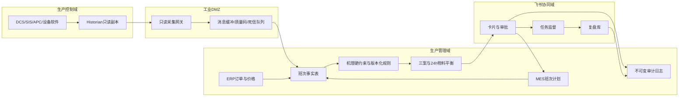

# 平台架构设计

## 定位与交付状态

氨智领航调控师位于生产运行管理层，服务合成氨调度员、班长、调度主管、设备、安环和经营人员。平台不替代DCS、SIS、APC和压机保护系统，不自动开停车。

- 已验证：本地交互工作台、飞书Base样例、飞书验收任务、GitHub交付链。
- 原型：互动卡片、负荷审批、知识问答、事件回调字段契约。
- 待企业联调：ERP/MES/IoT/DCS historian/APC/设备软件接口、真实点位、阈值和财务口径。

## 部署与数据链

OT到IT只读出域；审批通过后也只允许把计划摘要、交接说明和复盘结果写入MES或飞书，不提供DCS/SIS写入路径。

## 关键数据契约

每条事实至少包含 `source_system`、`source_timestamp`、`ingested_at`、`unit`、`quality_code`、`owner`、`value` 和 `lineage_id`。每条建议至少包含 `recommendation_id`、输入快照哈希、规则/模型版本、有效期、审批路径、回滚条件和幂等键。市场价格未经运营确认时只提示，不进入自动重算。

## 建议状态机

`草稿 -> 待班长确认 -> 已批准 -> 执行跟踪 -> 班末复盘 -> 归档`

驳回、超时、数据失效或执行偏差超过3pct均进入回滚/重算分支。任何状态迁移记录操作人、时间、前后状态、原因和载荷哈希，重复回调由幂等键拦截，失败事件进入死信队列人工补偿。

## 核心模块

| 模块 | 首批作用 | 验收证据 |
| --- | --- | --- |
| 班次事实表 | 统一订单、库存、工况、设备、能源和审批口径 | 字段字典、来源、时间戳、质量码、责任专业 |
| 24h液氨平衡 | 期初可用量+预计产量+外采-各去向分配=期末可用量 | 吨数守恒、安全库存和可支撑小时数 |
| 经济账本 | 净收入-非氨变动成本-物流-液氨机会成本-启停摊销+违约避免额 | 财务可逐项复算，固定成本不重复计入 |
| 弱信号证据 | 展示振动、轴位移、防喘振裕度、轴承温度的趋势证据 | AI提示与DCS报警分级、责任人与检查清单 |
| 协同执行 | 卡片、审批、任务、复盘形成责任链 | 状态机记录、实际执行反馈、驳回原因 |
| 知识治理 | 班后案例进入检索库，候选规则须专家审核 | 规则版本、适用域、审核人和回滚版本 |

## 权限与运行治理

- 调度员可查看和提交草稿；班长可确认低风险建议；高风险建议由调度主管和相关专业会签；管理员不能代替业务审批人。
- 应用密钥只保存在服务端密钥库，仓库和前端不保存App Secret；飞书回调必须验签、防重放并限制来源。
- 数据超时、质量码无效、关键字段缺失、模型越出适用域时自动降级为人工规则提醒。
- 规则、模型和知识案例均版本化；未经审核的班组经验不能直接成为自动规则。
- 监控接口延迟、回调失败率、死信积压、建议采纳率、执行偏差和回滚次数，并保留模型/规则一键回退能力。
